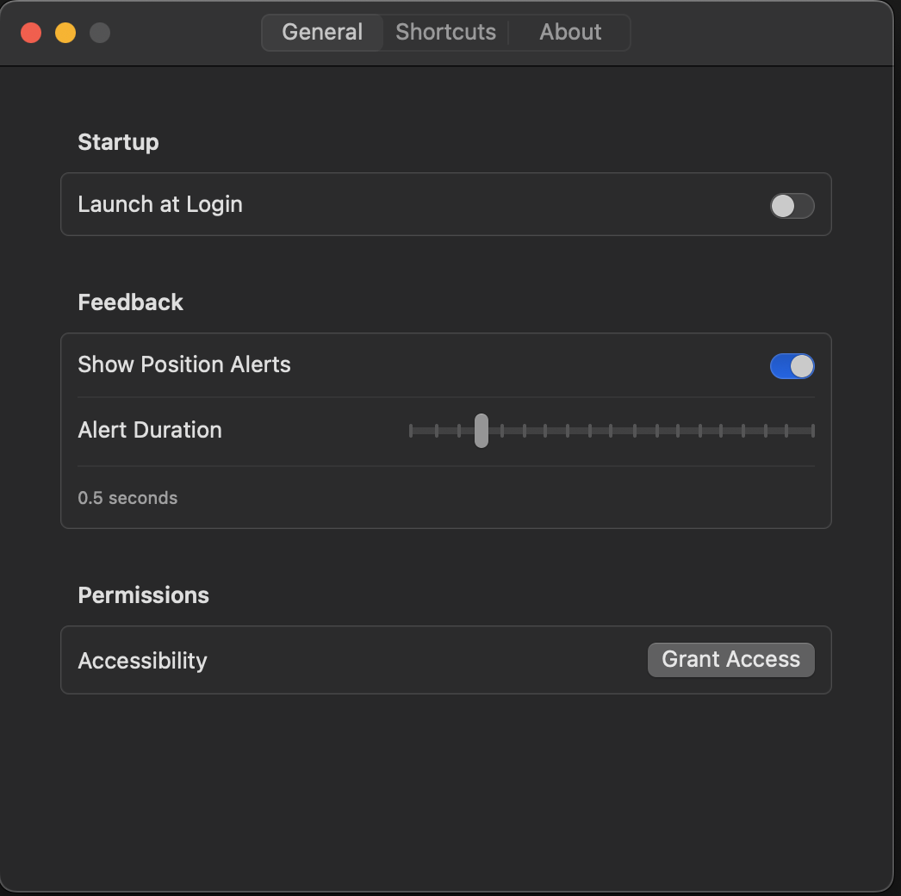
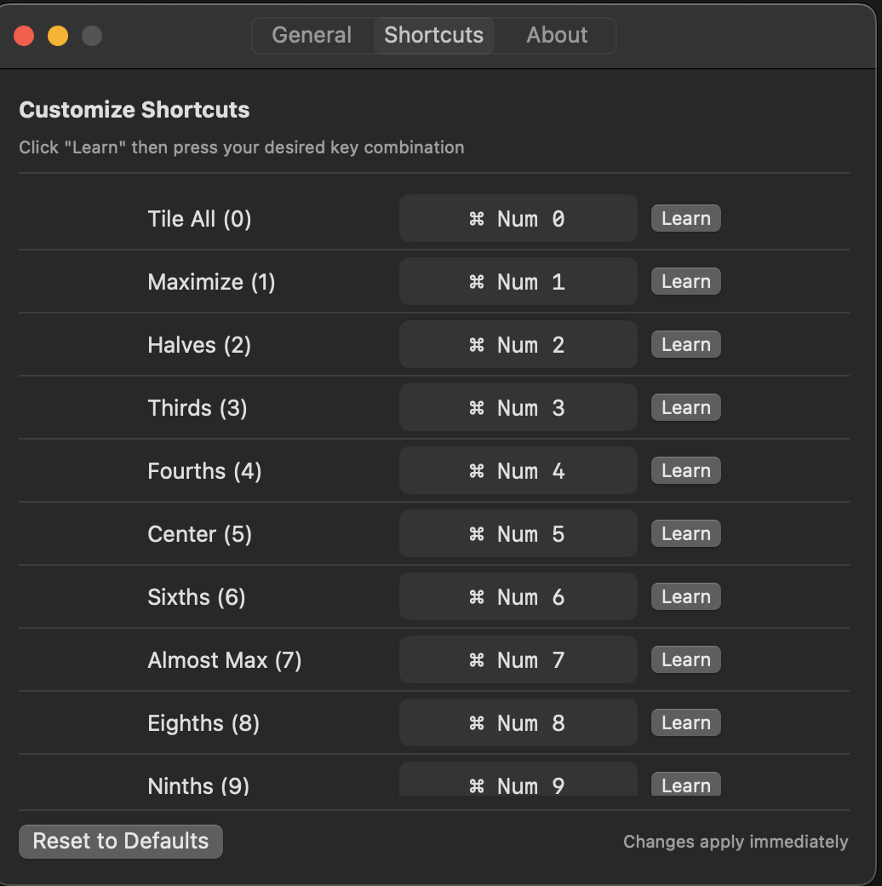
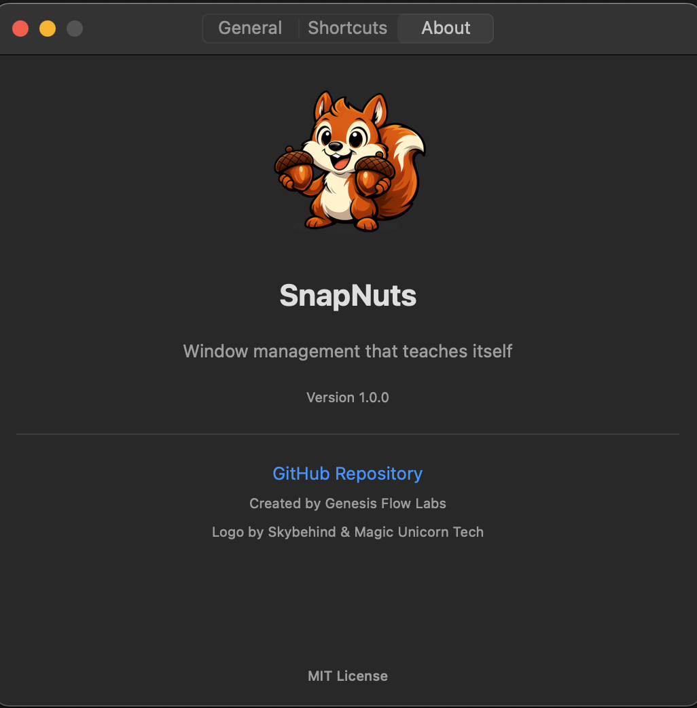

# SnapNuts

<p align="center">
  
</p>

<p align="center">
  <strong>The number = the division.</strong><br>
  Window management that teaches itself.
</p>

<p align="center">
  <a href="https://github.com/GenesisFlowLabs/snapnuts/releases/latest"></a>
  <a href="https://github.com/GenesisFlowLabs/snapnuts/blob/main/LICENSE"></a>
  
  
</p>

---

## The Idea

Most keyboard shortcuts are arbitrary. `Cmd+Shift+Option+Left`? Good luck remembering that.

SnapNuts is different:

| Want this? | Press this |
|:-----------|:-----------|
| **2** pieces | Cmd + **2** |
| **3** pieces | Cmd + **3** |
| **4** pieces | Cmd + **4** |
| **8** pieces | Cmd + **8** |
| **9** pieces | Cmd + **9** |

**The number IS the meaning.** You'll never forget it because there's nothing to forget.

---

## Download

<p align="center">
  <a href="https://github.com/GenesisFlowLabs/snapnuts/releases/latest/download/SnapNuts-1.0.0.dmg">
    
  </a>
</p>

Or build from source:

```bash
git clone https://github.com/GenesisFlowLabs/snapnuts.git
cd snapnuts/SnapNutsApp
./build.sh
open build/SnapNuts.app
```

---

## Screenshots

<p align="center">
  
  
  
</p>

---

## Features

| Feature | Description |
|:--------|:------------|
| **Native Performance** | Built with Swift and SwiftUI, runs as a lightweight menu bar app |
| **Customizable Shortcuts** | Click "Learn" to record any key combination you want |
| **Visual Feedback** | On-screen alerts show which position you've snapped to |
| **Multi-Monitor Support** | Automatically cycles through all your displays |
| **No Dependencies** | Just download and run. No Homebrew, no config files |

---

## The Complete System

Every shortcut cycles through positions, then **automatically moves to the next monitor**.

| Shortcut | Division | Positions |
|:--------:|:--------:|:----------|
| Cmd + 0 | Tile All | Organizes all visible windows |
| Cmd + 1 | Maximize | Full screen, cycles monitors |
| Cmd + 2 | Halves | Left / Right |
| Cmd + 3 | Thirds | Left / Center / Right |
| Cmd + 4 | Fourths | 4 strips + 4 corners (8 total) |
| Cmd + 5 | Center | 80% centered |
| Cmd + 6 | Sixths | 3x2 grid |
| Cmd + 7 | Almost Max | 90% centered |
| Cmd + 8 | Eighths | 4x2 grid |
| Cmd + 9 | Ninths | 3x3 grid |
| Cmd + Opt + 4 | Sixteenths | 4x4 grid |

---

## Visual Guide

### Cmd + 4: Fourths + Corners

Unlike other window managers, **one key gives you 8 positions**:

```
Presses 1-4 (Strips):              Presses 5-8 (Corners):
┌─────┬─────┬─────┬─────┐          ┌───────────┬───────────┐
│     │     │     │     │          │           │           │
│  1  │  2  │  3  │  4  │          │     5     │     6     │
│     │     │     │     │          ├───────────┼───────────┤
│     │     │     │     │          │     7     │     8     │
└─────┴─────┴─────┴─────┘          └───────────┴───────────┘
```

### Cmd + 9: Ninths (3x3)

```
┌───────┬───────┬───────┐
│   1   │   2   │   3   │
├───────┼───────┼───────┤
│   4   │   5   │   6   │
├───────┼───────┼───────┤
│   7   │   8   │   9   │
└───────┴───────┴───────┘
```

### Cmd + Opt + 4: Sixteenths (4x4)

```
┌─────┬─────┬─────┬─────┐
│  1  │  2  │  3  │  4  │
├─────┼─────┼─────┼─────┤
│  5  │  6  │  7  │  8  │
├─────┼─────┼─────┼─────┤
│  9  │ 10  │ 11  │ 12  │
├─────┼─────┼─────┼─────┤
│ 13  │ 14  │ 15  │ 16  │
└─────┴─────┴─────┴─────┘
```

Perfect for ultra-wide monitors.

---

## Architecture

```
┌─────────────────────────────────────────────────────────────┐
│                         SnapNuts                             │
├─────────────────────────────────────────────────────────────┤
│                                                              │
│  ┌─────────────┐  ┌─────────────┐  ┌─────────────┐         │
│  │   SwiftUI   │  │   Window    │  │   Hotkey    │         │
│  │  Settings   │◄─┤   Manager   │◄─┤   Manager   │         │
│  └─────────────┘  └─────────────┘  └─────────────┘         │
│         │               │                │                  │
│         ▼               ▼                ▼                  │
│  ┌─────────────┐  ┌─────────────┐  ┌─────────────┐         │
│  │   AppKit    │  │ Accessibility│  │   Carbon    │         │
│  │  NSWindow   │  │  AXUIElement │  │  EventMgr   │         │
│  └─────────────┘  └─────────────┘  └─────────────┘         │
│                                                              │
└─────────────────────────────────────────────────────────────┘
```

---

## System Requirements

- macOS 13.0 (Ventura) or later
- Apple Silicon or Intel
- Accessibility permissions (prompted on first launch)

---

## No Numpad?

SnapNuts registers fallback shortcuts for keyboards without a numpad:

**Cmd + Ctrl + Number** works the same as **Cmd + Numpad**

---

## Project Structure

```
snapnuts/
├── README.md
├── LICENSE
├── logo.png
├── screenshots/
│   ├── settings-general.png
│   ├── settings-shortcuts.png
│   └── settings-about.png
└── SnapNutsApp/
    ├── build.sh
    ├── Resources/
    │   └── AppIcon.appiconset/
    └── Sources/SnapNuts/
        ├── SnapNutsApp.swift
        ├── WindowManager.swift
        ├── HotkeyManager.swift
        ├── AlertWindow.swift
        ├── SettingsView.swift
        ├── ShortcutRecorder.swift
        └── Info.plist
```

---

## Credits

| | |
|:--|:--|
| **Created by** | [Genesis Flow Labs](https://genesisflowlabs.com) |
| **Refined by** | [Magic Unicorn Tech](https://magicunicorn.tech) |
| **Logo** | [Skybehind](https://github.com/skybehind) |
| **Built with** | [Claude](https://claude.ai) (Anthropic) |

This project was built with AI assistance. The humans provided the vision and direction, Claude helped with implementation.

---

## License

MIT License. Do whatever you want with it.

---

<p align="center">
  <strong>A Genesis Flow Labs Project</strong><br>
  <em>"The number = the division."</em>
</p>
